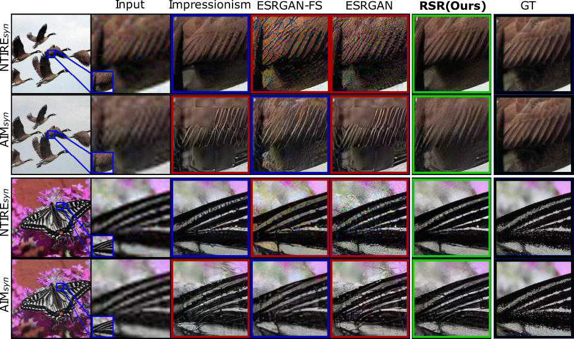

This is the official implementation of the paper: Generalized Real-World Super-Resolution through Adversarial Robustness.

## Paper
[Generalized Real-World Super-Resolution through Adversarial Robustness](https://arxiv.org/pdf/2108.11505.pdf)  
[Angela Castillo]() 1, [María Escobar]() 1, [Juan C. Pérez]() 1, 2, [Andrés Romero](https://afromero.co/en) 3, [Radu Timofte](https://scholar.google.com/citations?user=u3MwH5kAAAAJ&hl=en) 3, [Luc Van Gool](https://scholar.google.com/citations?user=TwMib_QAAAAJ&hl=en) 3, [Pablo Arbelaez](https://scholar.google.com.co/citations?user=k0nZO90AAAAJ&hl=en)1  
1 Center for Research and Formation in Artificial Intelligence ([CinfonIA](https://cinfonia.uniandes.edu.co)), Universidad de Los Andes.  
1 Image and Video Understanding Lab ([IVUL](https://cemse.kaust.edu.sa/ivul)) , KAUST.  
3 Computer Vision Lab ([CVL](https://www.vision.ee.ethz.ch/en/)), ETH Zürich.  
 

## Abstract
Real-world Super-Resolution (SR) has been traditionally tackled by first learning a specific degradation model that resembles the noise and corruption artifacts in low-resolution imagery. Thus, current methods lack generalization and lose their accuracy when tested on unseen types of corruption. In contrast to the traditional proposal, we present Robust Super-Resolution (RSR), a method that leverages the generalization capability of adversarial attacks to tackle real-world SR. Our novel framework poses a paradigm shift in the development of real-world SR methods. Instead of learning a dataset-specific degradation, we employ adversarial attacks to create difficult examples that target the model’s weaknesses. Afterward, we use these adversarial examples during training to improve our model’s capacity to process noisy inputs. We perform extensive experimentation on synthetic and real-world images and empirically demonstrate that our RSR method generalizes well across datasets without re-training for specific noise priors. By using a single robust model, we outperform state-of-the-art specialized methods on real-world benchmarks.

## Code
Stay tuned.

Find other resources in our [webpage](https://cinfonia.uniandes.edu.co/publications/generalized-real-world-super-resolution-through-adversarial-robustness/).
